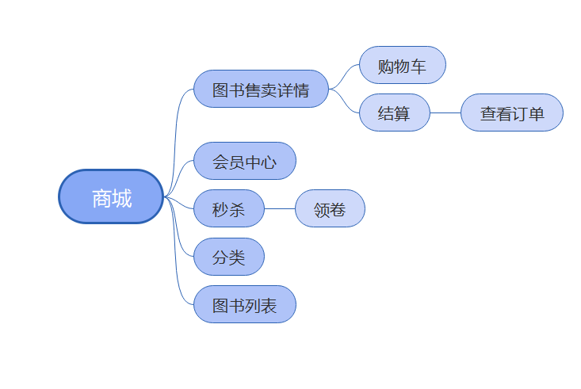
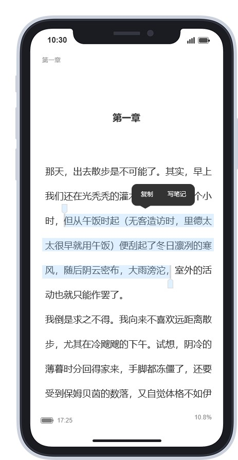
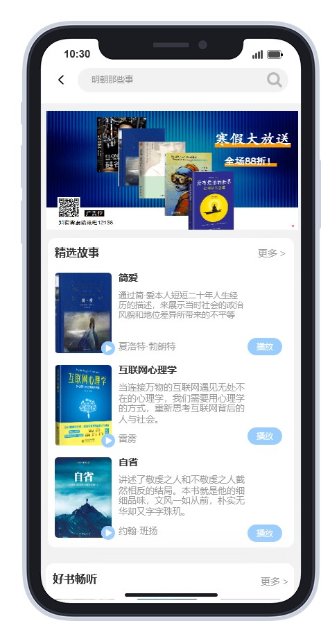
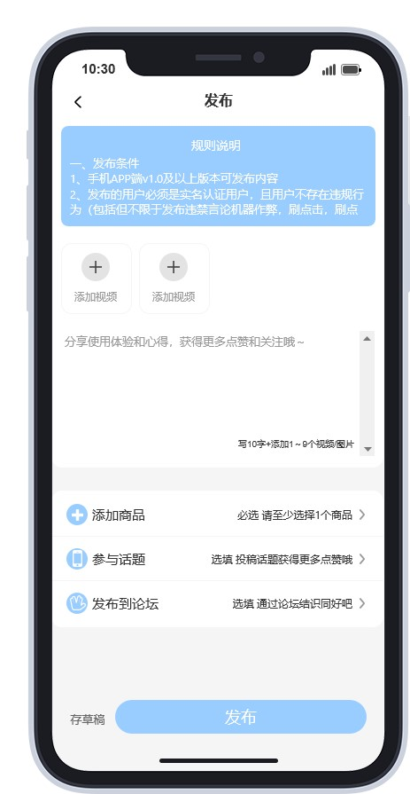
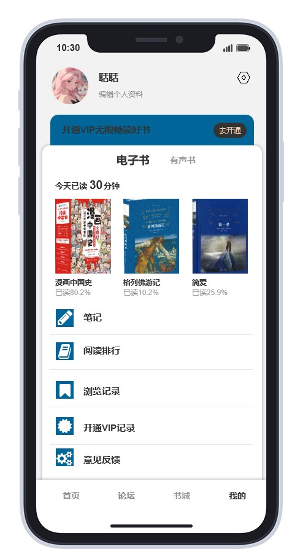
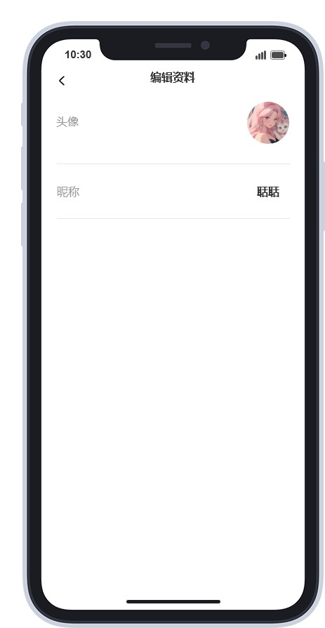
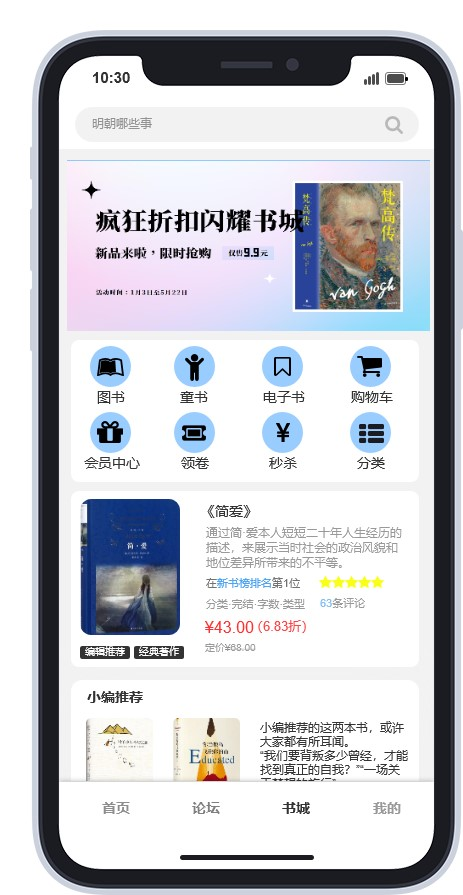
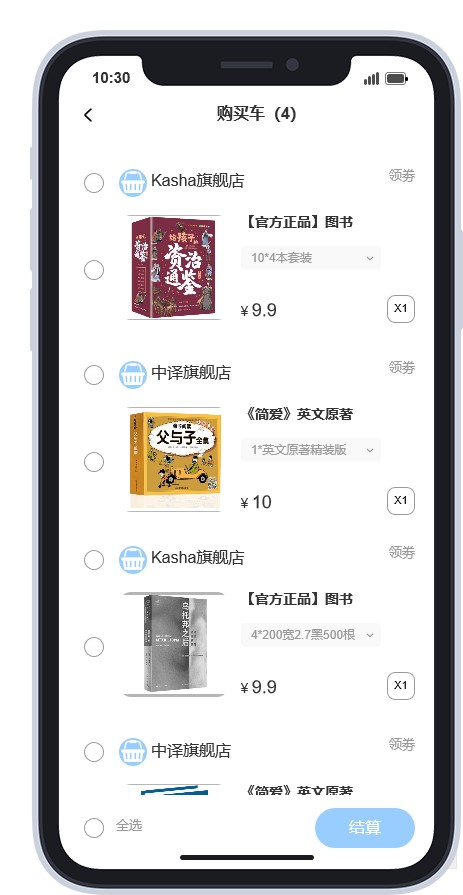
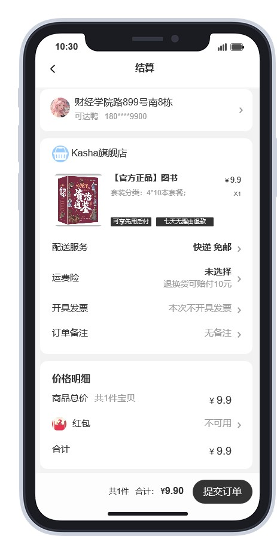
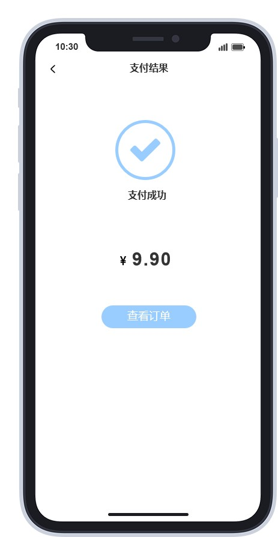

# 汇读 · 智能阅读服务系统

> 一款面向数字阅读爱好者的综合型阅读 APP 产品方案，覆盖「阅读 + 听书 + 社区 + 电商」四大场景。
> 本仓库为设计作品集，包含 PRD、Axure 原型、业务流程图、信息架构图、UI 页面切图及设计迭代稿。

---

## 一、项目概述

| 项目     | 内容                                                                       |
| -------- | -------------------------------------------------------------------------- |
| 产品名称 | **汇读** 智能阅读服务系统                                            |
| 产品类型 | 移动 APP（Android / iOS）                                                  |
| 核心定位 | 集电子书阅读、有声听书、书友论坛、图书商城于一体的智能阅读服务平台         |
| 设计工具 | Axure RP（原型）、Adobe Illustrator / Photoshop（视觉）、XMind（思维导图） |
| 适用场景 | 毕业设计作品集、产品经理/UX 面试作品展示                                   |

### 1.1 产品价值主张

在数字阅读需求持续增长的背景下，**汇读** 通过以下差异化能力提升阅读体验：

- **沉浸式阅读**：支持字号调节、夜间模式、目录跳转、笔记批注、翻译辅助；
- **解放双眼**：提供有声听书与听书排行榜，满足通勤、睡前等多场景需求；
- **书友社区**：论坛模块支持话题发布、阅读打卡、达人认证，强化用户粘性；
- **一站式购书**：书城 + 购物车 + 支付闭环，覆盖电子书和实体书购买；
- **数据沉淀**：个人中心展示阅读时长、阅读日历、阅读数量统计，帮助用户管理阅读习惯。

---

## 二、目标用户与需求分析

### 2.1 目标用户画像

基于用户年龄分布柱状图与性别比例分析，目标用户以 **18–35 岁青年群体** 为主，性别比例相对均衡，核心特征包括：

- 学生群体：有课外阅读、考试备考、论文资料查找需求；
- 职场白领：通勤时间碎片化，偏好听书与电子书；2
- 阅读爱好者：重视笔记、批注、社区交流等深度阅读体验。

### 2.2 核心需求拆解

| 用户痛点            | 产品解法                         | 对应模块 |
| ------------------- | -------------------------------- | -------- |
| 找不到想读的书      | 分类检索、排行榜、搜索、轮播推荐 | 书城     |
| 阅读时想做笔记/翻译 | 批注、笔记、翻译、字号/夜间设置  | 阅读     |
| 眼睛疲劳            | 有声听书、听书排行榜             | 阅读听书 |
| 缺少交流氛围        | 论坛发布、话题互动、阅读达人认证 | 论坛     |
| 想购买实体/电子书   | 商城、购物车、优惠券、支付       | 商城     |
| 想追踪阅读习惯      | 阅读时长、阅读日历、数量统计     | 我的     |

---

## 三、产品架构设计

### 3.1 信息架构图

产品整体采用 **「底部 Tab + 内容聚合」** 结构，四大一级入口：

```
汇读 APP
├── 书架（首页）
│   ├── 最近阅读
│   ├── 收藏/喜欢的图书
│   └── 阅读笔记展示
├── 书城
│   ├── 搜索
│   ├── 分类（二级分类、全部分类）
│   ├── 排行榜（热门榜、畅销榜、新书榜、好评榜、口碑榜）
│   ├── 秒杀 / 红包 / 优惠券
│   └── 图书详情 / 售卖详情
├── 论坛
│   ├── 论坛首页
│   ├── 话题发布
│   ├── 论坛消息
│   └── 阅读打卡 / 达人认证
└── 我的
    ├── 个人资料
    ├── 阅读统计（时长、日历、数量）
    ├── 笔记 / 标记的笔记
    ├── 浏览记录
    ├── 订单 / 购物车
    ├── VIP / 券
    └── 设置 / 意见反馈
```

> 对应素材：`信息框架图.png`、`功能架构图.png`

### 3.2 功能架构图

功能层从下到上划分为：

1. **基础支撑层**：账号体系、支付、消息推送、网络异常处理；
2. **内容管理层**：图书资源、分类标签、排行榜算法、广告位；
3. **核心业务层**：阅读、听书、论坛、商城、我的；
4. **用户触达层**：首页推荐、搜索、活动运营、个性化推荐。

> 对应素材：`功能架构图.png`

---

## 四、核心业务流程

本方案对关键用户旅程进行了完整梳理，确保流程闭环与异常处理。

### 4.1 登录流程

支持账号密码登录，包含网络异常提示、登录态管理等分支。

> 对应素材：`登录流程图.png`

### 4.2 阅读 / 听书流程

```
书城选书 → 进入图书详情 → 开始阅读/听书 → 目录跳转/字号调节/夜间模式
            ↓
        做笔记 / 翻译 / 批注 / 收藏
            ↓
        标记的笔记 / 阅读历史 / 阅读统计
```

> 对应素材：`阅读听书流程图.png`、`阅读听书.png`、`页面切图/正文.jpg`、`页面切图/翻译.jpg`、`页面切图/笔记.jpg`

### 4.3 商城购书流程

```
浏览书城 → 加入购物车 → 结算 → 选择优惠券/红包 → 支付 → 支付成功 → 查看订单
```

> 对应素材：`商城流程图.png`、`商城.png`、`页面切图/购物车.jpg`、`页面切图/结算.jpg`、`页面切图/支付.jpg`、`页面切图/支付成功.jpg`、`页面切图/查看订单.jpg`

### 4.4 论坛互动流程

```
进入论坛首页 → 浏览话题 → 发布内容 → 接收论坛消息 → 参与阅读打卡/达人认证
```

> 对应素材：`论坛流程图.png`、`论坛.png`、`页面切图/论坛首页.jpg`、`页面切图/论坛发布.jpg`、`页面切图/论坛消息.jpg`

### 4.5 「我的」需求流程

```
个人中心 → 阅读统计 / 笔记管理 / 订单管理 / VIP / 设置 / 意见反馈
```

> 对应素材：`我的需求流程图.png`、`我的.png`、`页面切图/我的.jpg`

---

## 五、从需求到上线：完整产品工作流程

> 主线：**需求分析 → 产品架构设计 → 原型设计 → 研发跟进 → 测试上线**

### 5.1 需求分析

- **市场调研**：分析数字阅读行业现状，对比 QQ 阅读、微信读书等竞品，识别差异化机会；
- **用户研究**：通过年龄、性别等数据建立用户画像，明确核心痛点；
- **需求整理**：输出需求清单，划分为 KANO 模型中的基本型、期望型、兴奋型需求。

> 对应素材：`可行性.png`、`目标梳理.png`、`用户年龄分析柱状图.png`、`用户性别之比.png`、`用户男女比例.png`

### 5.2 产品架构设计

- **信息架构**：定义四大 Tab 及二级页面，保证信息层级清晰；
- **功能架构**：划分基础支撑、内容管理、核心业务、用户触达四层；
- **流程设计**：绘制登录、阅读、听书、商城、论坛、我的等关键业务流程图，覆盖主路径与异常分支。

> 对应素材：`信息框架图.png`、`功能架构图.png`、各流程图

### 5.3 原型与交互设计

- 使用 **Axure RP** 完成高保真原型，覆盖四大模块核心页面；
- 输出页面切图，包含正常态、空态、异常态（如搜索为空、网络异常提示）；
- 进行 Logo 设计迭代，从 1.0 到 3.0 持续优化视觉识别。

> 对应素材：`PRD文档9.0.2*.rp`、`书.rp`、`汇读.rp`、`页面切图/`、`毕设/logo设计迭代/`

### 5.4 研发跟进

- 撰写 PRD，明确功能描述、业务规则、页面逻辑、异常处理；
- 进行需求评审，拆解技术实现方案（前端、后端、数据库、接口）；
- 完成 MySQL 数据库设计，涵盖用户、图书、书架、笔记、订单、论坛等 14 张核心数据表，输出 ER 图（`docs/er-diagram.png` / `docs/er-diagram.dbml`）与建表 SQL；
- 定义 RESTful API 接口规范，覆盖用户、图书、阅读、商城、论坛、统计等模块，统一鉴权、响应格式与错误码；
- 跟进开发进度，处理需求变更与优先级调整；
- 确认视觉还原度，保证 UI 切图与交互文档一致。

> 对应素材：
>
> - PRD 与需求文档：`毕设/系统功能分析.docx`、`PRD文档9.0.2*.rp`（见下方第八章）
> - 数据库设计：`docs/DATABASE-DESIGN.md`
> - 接口设计：`docs/API-DESIGN.md`

### 5.5 系统技术架构（数据如何流转）

```
┌─────────────┐      HTTPS / JWT       ┌─────────────┐      SQL / Redis       ┌─────────────┐
│   汇读 APP   │  ◀─────────────────▶│  后端服务    │  ◀──────────────────▶│  MySQL 数据库 │
│  (Android /  │                       │ (Spring     │                        │              │
│   iOS / H5)  │                       │  Boot /     │                        │              │
│              │                       │  Node.js)   │                        │              │
└─────────────┘                        └─────────────┘                        └─────────────┘
                                             │
                                             ▼
                                      ┌─────────────┐
                                      │    Redis    │
                                      │  缓存 / 会话 │
                                      └─────────────┘
```

- **客户端**：用户通过 APP 发起请求；
- **后端服务**：处理业务逻辑、鉴权、数据校验；
- **MySQL**：持久化存储用户、图书、订单、论坛等核心业务数据；
- **Redis**：缓存热门图书、用户会话、阅读进度等高频访问数据。

> 说明：本作品集阶段已完成数据库表结构与 API 接口设计文档，技术实现方案明确，可直接进入开发。

### 5.6 可运行 Demo（新增）

为验证产品方案的可行性，已基于设计文档实现了一套可本地运行的前后端 Demo。

**技术栈**

| 端   | 技术                             |
| ---- | -------------------------------- |
| 前端 | Vite + React + Ant Design Mobile |
| 后端 | Node.js + Express + MySQL 8      |
| 鉴权 | JWT                              |

**已覆盖功能**

- 用户注册 / 登录 / JWT 鉴权
- 书城首页（搜索、分类、热门推荐）
- 分类列表
- 图书详情（加入书架、开始阅读）
- 章节阅读（目录抽屉、字号调节、夜间模式、上一章/下一章、进度保存）
- 我的书架
- 我的（个人信息、退出登录）
- 论坛入口（占位）

**快速启动**

```bash
# 1. 安装 MySQL 8 并启动服务，记住 root 密码

# 2. 配置后端环境变量
cd demo/server
copy .env.example .env   # Windows
cp .env.example .env     # macOS / Linux
# 编辑 .env，填写 DB_PASSWORD

# 3. 初始化数据库并启动后端
npm install
npm run seed
npm run dev

# 4. 启动前端（新开终端）
cd demo/client
npm install
npm run dev
```

- 前端地址：`http://localhost:5173`
- 后端地址：`http://localhost:3001`
- 测试账号：`test / 123456`（昵称：聒聒）

**演示说明**

- 前端已固定为移动端 App 尺寸（最大宽度 430px，居中显示），适合在桌面浏览器模拟手机或同一局域网真机访问；
- 封面、分类、头像等图片已接入本地资源（`demo/server/uploads/`），无需外网即可演示；
- 购物车、订单、支付、论坛为占位或未实现模块。

> 详细说明见：`demo/Demo小结.md`

### 5.7 静态版部署（无需后端）

如果你只想让页面脱离 `localhost` 直接在线访问，而不想购买服务器、配置 MySQL，可以使用**静态版 Demo**：

- 前端接口已改为本地 Mock 数据
- 图片资源已打包进前端
- 路由已改为 HashRouter，支持 GitHub Pages / Vercel / Netlify 等静态托管
- 已配置 GitHub Actions，push 到 `main` 后自动部署到 GitHub Pages

**部署方式**：

```bash
cd demo/client
npm install
npm run build
# 然后上传 dist/ 到 GitHub Pages / Vercel / Netlify
```

详细步骤见：`demo/STATIC-DEPLOY.md`

### 5.8 测试与上线

- **功能测试**：验证登录、阅读、听书、商城、支付、论坛等核心流程；
- **异常测试**：网络异常、支付失败、搜索为空、未登录拦截等场景；
- **用户体验测试**：收集目标用户反馈，优化阅读设置、社区互动等细节；
- **上线运营**：配合开屏广告、轮播位、秒杀/红包活动进行冷启动（如果上线打算这么做）。

> 对应素材：`页面切图/网络异常提示.jpg`、`页面切图/网络异常提示2.jpg`、`页面切图/开屏.jpg`、`轮播图1.png`、`轮播图2.png`

---

## 六、主要页面预览

### 6.1 书城与阅读

| 书城首页                             | 图书详情                                        | 电子书阅读                                   | 听书                                      |
| ------------------------------------ | ----------------------------------------------- | -------------------------------------------- | ----------------------------------------- |
|  |  |  |  |

### 6.2 论坛与我的

| 论坛首页                                       | 论坛发布                                       | 我的                                    | 个人资料                                         |
| ---------------------------------------------- | ---------------------------------------------- | --------------------------------------- | ------------------------------------------------ |
|  |  |  |  |

### 6.3 购物流程

| 商城                                 | 购物车                                 | 结算                                     | 支付成功                                            |
| ------------------------------------ | -------------------------------------- | ---------------------------------------- | --------------------------------------------------- |
|  |  |  |  |

---

## 七、仓库目录说明

```
.
├── docs/
│   ├── DATABASE-DESIGN.md       # MySQL 数据库设计文档（含 ER 图与建表 SQL）
│   ├── API-DESIGN.md            # RESTful API 接口设计文档
│   └── CO-WORKING-REVIEW.md     # Demo 开发协作复盘
├── demo/                        # 可运行前后端 Demo
│   ├── client/                  # React + Vite 前端
│   ├── server/                  # Express + MySQL 后端
│   └── README.md                # Demo 运行说明
├── assets/
│   └── screenshots/             # README 中引用的页面预览截图
├── PRD文档9.0.2.rp              # 完整版 PRD / 原型（含所有模块）
├── PRD文档9.0.2app版.rp         # APP 聚焦版 PRD / 原型
├── PRD文档9.0.2无app版.rp       # 非 APP 场景版 PRD / 原型
├── 书.rp                        # 图书模块原型
├── 汇读.rp                      # 汇读 APP 原型
├── 毕设/
│   ├── 系统功能分析.docx        # 系统功能说明文档
│   ├── 书.rp / 汇读.rp          # 原型源文件
│   ├── logo设计迭代/            # Logo 1.0–3.0 设计稿与源文件
│   ├── 开题报告 / 任务书 / 文献综述
│   └── 绘图4.jpg                # 手绘/概念草图
├── 页面切图/                    # 高保真 UI 页面切图（JPG）
├── 书籍插图/                    # 示例图书封面与分类插图
├── 头像.jpg                     # Demo 测试用户头像
├── 论坛/                        # 论坛话题/活动相关素材
├── 信息框架图.png               # 信息架构图
├── 功能架构图.png               # 功能架构图
├── 可行性.png                   # 可行性分析
├── 目标梳理.png / 目标梳理.xmind # 产品目标与需求梳理
├── 用户年龄分析柱状图.png       # 用户年龄分布
├── 用户性别之比.png             # 用户性别比例
├── 登录流程图.png               # 登录流程
├── 商城流程图.png               # 商城购书流程
├── 阅读听书流程图.png           # 阅读/听书流程
├── 论坛流程图.png               # 论坛互动流程
├── 我的需求流程图.png           # 我的模块流程
├── 商城.png / 论坛.png / 我的.png / 阅读听书.png / 首页.png
├── 轮播图1.png / 轮播图2.png     # 运营轮播素材
└── README.md                    # 本文件
```

---

## 八、PRD 版本说明

### 8.1 Axure 原型（主 PRD）

| 版本            | 文件名                     | 说明                                  |
| --------------- | -------------------------- | ------------------------------------- |
| 9.0.2           | `PRD文档9.0.2.rp`        | 完整版：覆盖 APP 全部模块与业务逻辑   |
| 9.0.2 app 版    | `PRD文档9.0.2app版.rp`   | 聚焦 APP 端交互与页面流程             |
| 9.0.2 无 app 版 | `PRD文档9.0.2无app版.rp` | 弱化 APP 载体，强调业务与系统功能设计 |

> 三个版本均使用 **Axure RP 10** 格式，需要用 Axure RP 9/10 打开浏览完整交互。

### 8.2 历史版本与过程文档（`docs/prd-versions/`）

为展示从需求到成品的迭代过程，仓库额外保留了多个 PRD 中间版本与毕设过程文档：

| 文件/目录                                   | 说明                                       |
| ------------------------------------------- | ------------------------------------------ |
| `prd-app.txt` / `prd-app-clean.txt`     | APP 聚焦版 PRD 的原始导出与纯文本提取      |
| `prd-full.txt` / `prd-full-clean.txt`   | 完整版 PRD 的原始导出与纯文本提取          |
| `prd-noapp.txt` / `prd-noapp-clean.txt` | 弱化 APP 场景版 PRD 的原始导出与纯文本提取 |
| `开题报告.txt`                            | 毕业设计开题报告                           |
| `任务书.txt`                              | 毕业设计任务书                             |
| `文献综述.txt`                            | 相关研究与文献综述                         |
| `系统功能分析.txt`                        | 系统功能要点提炼                           |
| `docx/`                                   | 原始 Word 文档解包后的资源文件             |

> 注：`*.txt` 文件为文档工具私有导出格式，建议配合源文件或导出 PDF 阅读。

---

## 九、声明

本项目为毕业设计/个人作品集，所有图书封面、头像等素材仅用于设计展示，不做商业用途。

---

*最后更新：2026-07-07（新增 docs/prd-versions/ PRD 历史版本与过程文档）*
